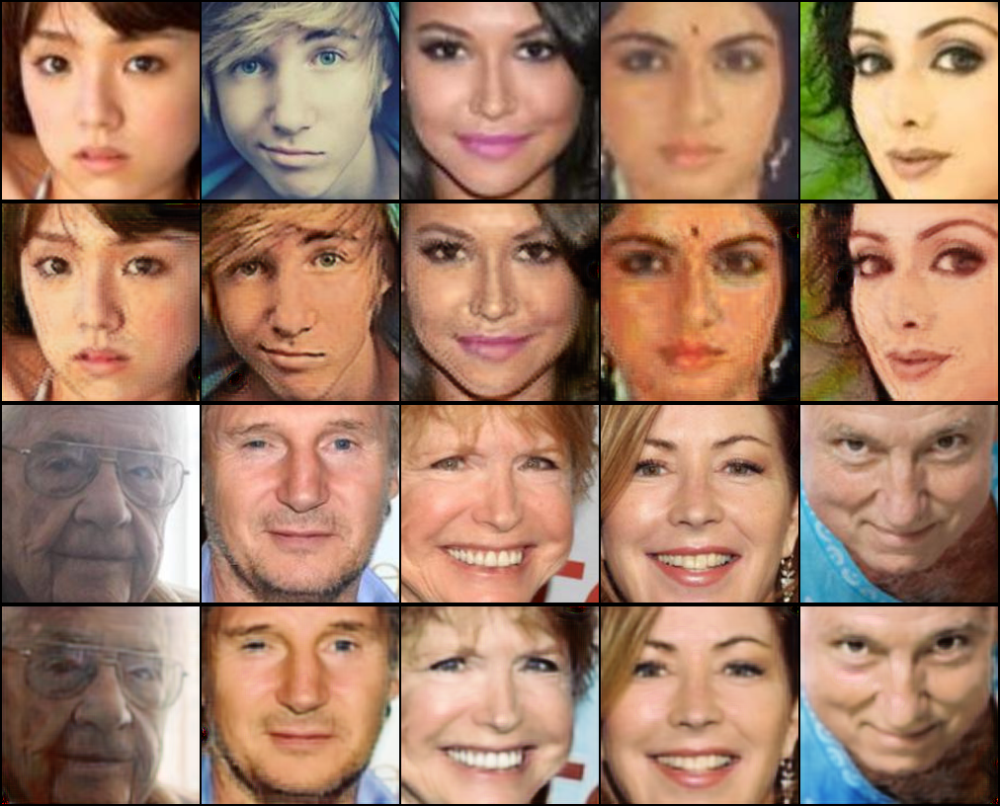
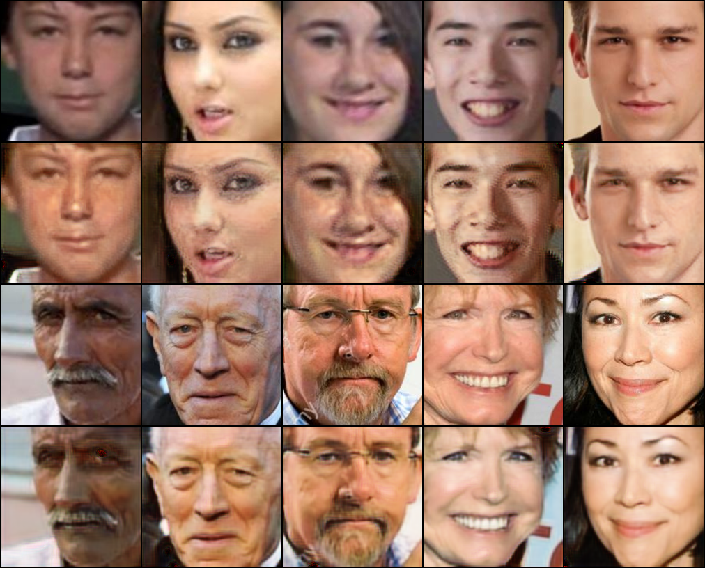

# FaceAgingGAN

A deep learning model that performs facial age transformation using CycleGAN architecture.

## Quick Start

```bash
# Install dependencies
pip install -r requirements.txt

# Run the web interface
streamlit run app.py
```

## Features

- Age progression and regression of facial images
- Real-time web interface
- Support for both CPU and GPU
- Pre-trained models included

## Technical Details

### Architecture

- **Generator**: ResNet-based with 3 residual blocks
- **Input Size**: 200x200 RGB images
- **Normalization**: Instance Normalization
- **Activation**: ReLU (hidden), Tanh (output)

### Model Structure
```python
GeneratorResNet(
    input: (3, 200, 200)
    residual_blocks: 3
    output: (3, 200, 200)
)
```

## Dataset

Uses UTKFace dataset split into two domains:
- **Young**: Ages 15-30
- **Old**: Ages 50+

### Dataset Preparation
```bash
# Download dataset
kaggle datasets download jangedoo/utkface-new

# Prepare splits
python prepare_dataset.py
```

## Usage

1. Start the Streamlit interface:
```bash
streamlit run app.py
```

2. Upload an image through the web interface
3. View the age-transformed result

## Examples

Here are some examples of the model's performance. Note that these examples are not the best, but they give you an idea of what the model can do. :p

- **Example 1**: 
- **Example 2**: 

## Model Performance

- Training time: ~2 hours on NVIDIA T4
- Average inference time: 0.5s per image
- Batch size: 1
- Learning rate: 2e-4

## Limitations

- Fixed input size (200x200)
- Best results on front-facing portraits
- May not preserve all facial details
- Performance varies with lighting conditions

## Requirements

- Python 3.8+
- PyTorch 1.9+
- CUDA 11.0+ (for GPU support)
- Streamlit 1.0+


## Acknowledgments

- [UTKFace Dataset](https://susanqq.github.io/UTKFace/)
- [CycleGAN Paper](https://arxiv.org/abs/1703.10593)

## License

MIT License
